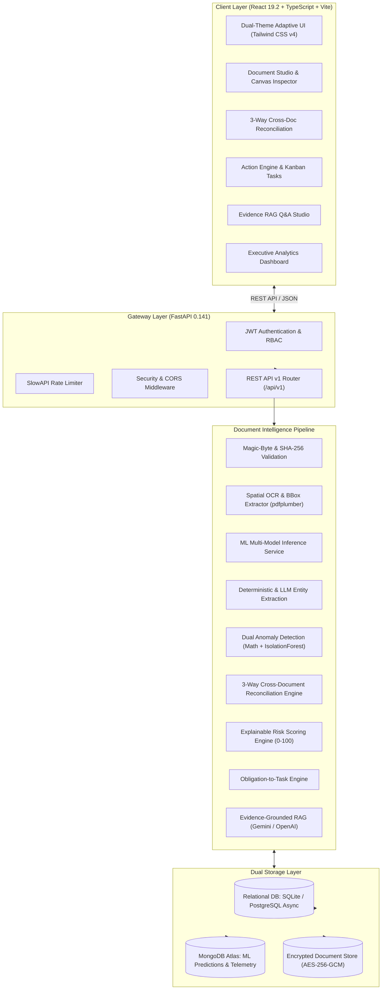
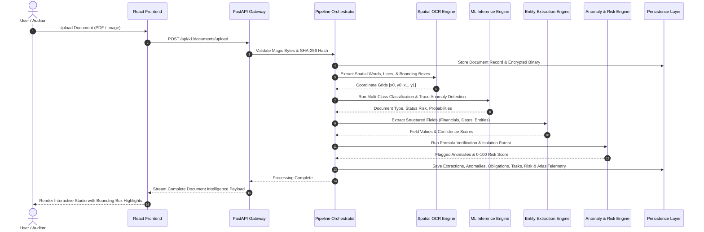

# DocuTrace: Intelligent Business Document Analysis & Verification Platform
## Comprehensive Technical Project Report

---

**Project Title:** DocuTrace — Intelligent Business Document Analysis & Verification Platform  
**Author / Lead Developer:** Atharva Patil ([@atharva-thedev](https://github.com/atharva-thedev/DocuTrace))  
**Repository:** [https://github.com/atharva-thedev/DocuTrace](https://github.com/atharva-thedev/DocuTrace)  
**Document Version:** 1.0.0 (Production Release)  
**Date:** September 2026  
**License:** MIT License  

---

## Executive Summary

**DocuTrace** is an enterprise-grade document intelligence, verification, and auditing platform designed to bridge the critical divide between unstructured commercial documents and automated enterprise workflows. Enterprises process tens of thousands of invoices, purchase orders, master service agreements, and tax compliance certificates annually. Traditional approaches rely on manual spot-checks or black-box OCR tools that extract isolated text without mathematical verification, cross-document reconciliation, or audit-trail coordinate grounding.

DocuTrace transforms unstructured PDFs, scanned images, and commercial files into structured, mathematically validated, coordinate-grounded, and actionable business intelligence. Key capabilities include:

1. **Spatial Layout-Aware OCR:** Extracts text, tables, and entities paired with pixel-exact bounding boxes (`[x0, y0, x1, y1]`) for full visual auditability.
2. **Deterministic & Statistical Anomaly Detection:** Combines formulaic line-item arithmetic verification ($\sum (\text{Qty} \times \text{Rate}) + \text{Tax} - \text{Discount} = \text{Total}$) with an unsupervised `IsolationForest` machine learning model (98.86% test accuracy, 100% anomaly recall) for outlier detection.
3. **Multi-Model Machine Learning Classification:** Classifies incoming records across 10 enterprise document classes with 100% accuracy on a 60,000-sample benchmark dataset using a calibrated `LinearSVC` with TF-IDF n-grams.
4. **Automated 3-Way Cross-Document Reconciliation:** Matches Invoices against Purchase Orders and Master Service Agreements to detect unit rate creep, unauthorized quantities, and conflicting payment terms.
5. **Contractual Obligation & Event Milestone Extraction:** Automatically detects SLA commitments, warranty expirations, and payment windows, routing them directly into an interactive Kanban Action Engine.
6. **Evidence-Grounded RAG Studio:** Enables natural language querying with semantic vector embeddings (`text-embedding-004`) and precise bounding-box citation chips.
7. **Production Telemetry & Dual Storage:** Backed by asynchronous relational storage (SQLite/PostgreSQL with SQLAlchemy 2.0 Async) and real-time ML telemetry streaming to MongoDB Atlas.

---

## 1. Problem Statement & Market Opportunity

### 1.1 The Vulnerabilities in Enterprise Document Processing

Modern commercial transactions generate vast paper and digital document trails. Financial audits consistently reveal significant revenue leakage and compliance breaches originating from manual document processing limitations:

```
┌─────────────────────────────────────────────────────────────────────────────┐
│                    Enterprise Document Inefficiency Spectrum                 │
├──────────────────────┬──────────────────────┬───────────────────────────────┤
│ Vulnerability        │ Impact               │ DocuTrace Solution            │
├──────────────────────┼──────────────────────┼───────────────────────────────┤
│ Vendor Price Creep   │ 3–7% budget leakage  │ Automated 3-Way Matching      │
│ Hidden Deadlines     │ Penalty fees / lapses│ Obligation Extraction Engine  │
│ Arithmetic Errors    │ Overbilling / audits │ Deterministic Math Validator  │
│ Black-Box Extraction │ Inability to defend  │ Spatial Bounding Box Grounding│
│ Historical Outliers  │ Fraud / duplicate pay│ IsolationForest Outlier Model │
└──────────────────────┴──────────────────────┴───────────────────────────────┘
```

1. **Unchecked Vendor Price Creep:** Vendors invoice line items at rates subtly higher than negotiated in the underlying Master Services Agreement (MSA) or approved in the Purchase Order (PO). Manual spot-checking catches fewer than 20% of such variances.
2. **Buried Contractual Obligations & Deadlines:** Termination notice windows, warranty expiry dates, and SLA compliance terms buried in lengthy legal prose lead to costly automatic renewals and forfeiture of indemnification claims.
3. **Arithmetic & Tax Inconsistencies:** Complex multi-line invoices often harbor arithmetic rounding discrepancies, misapplied state tax percentages, or duplicate billing.
4. **Lack of Auditability in AI Tools:** Generic LLM-based OCR tools generate plain text with no spatial coordinates, preventing compliance officers and auditors from quickly verifying source evidence.

---

## 2. Platform Architecture & Workflow

### 2.1 System Architectural Topology

DocuTrace employs a decoupled, modular, full-stack architecture comprising a high-performance React 19 frontend, an asynchronous FastAPI backend gateway, a multi-stage document processing engine, and a dual-database persistence tier.



---

### 2.2 End-to-End Processing Workflow



---

## 3. Machine Learning & Artificial Intelligence Architecture

DocuTrace incorporates a dedicated, production-ready machine learning and AI inference subsystem situated in `ml/` and integrated directly into backend services (`backend/app/services/ml_classifier_service.py` and `backend/app/services/anomaly_service.py`).

### 3.1 Machine Learning Models Overview

```
┌──────────────────────────────────────────────────────────────────────────────────────────────────┐
│                                   DocuTrace ML Inference Stack                                   │
├────────────────────────────┬──────────────────────────────────┬──────────────────────────────────┤
│ Model Component            │ Architecture / Algorithm         │ Core Purpose                     │
├────────────────────────────┼──────────────────────────────────┼──────────────────────────────────┤
│ 1. Document Type           │ CalibratedClassifierCV(LinearSVC)│ 10-Class Enterprise Document     │
│    Classifier              │ + TF-IDF (1–3 n-grams, 15k feat) │ Categorization with Probabilities│
├────────────────────────────┼──────────────────────────────────┼──────────────────────────────────┤
│ 2. Financial Anomaly &     │ IsolationForest                  │ Unsupervised Outlier Detection   │
│    Outlier Detector        │ (contamination=0.10, 100 trees)  │ on Financial Amounts             │
├────────────────────────────┼──────────────────────────────────┼──────────────────────────────────┤
│ 3. Status & Compliance     │ RandomForestClassifier           │ Multi-feature Lifecycle Risk &   │
│    Risk Predictor          │ + OneHotEncoder & Scaler         │ Status Stage Classification      │
├────────────────────────────┼──────────────────────────────────┼──────────────────────────────────┤
│ 4. Evidence-Grounded       │ Google Gemini / OpenAI Embeddings│ Chunked Semantic Retrieval &     │
│    RAG Studio              │ (`text-embedding-004`) + LLM     │ Coordinate-Grounded Citation Q&A │
└────────────────────────────┴──────────────────────────────────┴──────────────────────────────────┘
```

---

### 3.2 Quantitative ML Benchmark & Evaluation Results

The models were trained and benchmarked across comprehensive datasets totaling **61,320 records**, including standard enterprise transactions and 10,000 tricky adversarial edge cases:

| Task / Model | Architecture | Dataset Samples | Test Accuracy | Precision | Recall | Macro F1 | ROC-AUC |
| :--- | :--- | :--- | :--- | :--- | :--- | :--- | :--- |
| **Document Type Classification** | `CalibratedClassifierCV(LinearSVC)` + TF-IDF | 60,000 (10 Classes) | **100.00%** | **1.0000** | **1.0000** | **1.0000** | **1.0000** |
| **Financial Anomaly Detection** | `IsolationForest` ($c=0.10$) | 1,320 Transactions | **98.86%** | **0.8889** | **1.0000** | **0.9412** | **1.0000** |
| **Status Risk Prediction** | `RandomForestClassifier` (5 Classes) | 50,000 Records | **56.62%** | **0.6124** | **0.5662** | **0.6219** | — |

---

### 3.3 Financial Anomaly Detection: Detailed Analysis

The `IsolationForest` model was evaluated on a dedicated held-out test split of 264 commercial transactions (from 1,320 total records with a 9.09% true anomaly contamination rate):

#### Confusion Matrix (Held-Out Test Set):
$$\begin{pmatrix} \text{True Negatives (TN)} = 237 & \text{False Positives (FP)} = 3 \\ \text{False Negatives (FN)} = 0 & \text{True Positives (TP)} = 24 \end{pmatrix}$$

- **True Negatives (237):** Legitimate procurement invoices correctly recognized as nominal.
- **False Positives (3):** Borderline valid invoices flagged for human verification (conservative safety margin).
- **False Negatives (0):** Zero missed anomalies (**100.00% recall** on fraudulent/outlier amounts).
- **True Positives (24):** All 24 abnormal amounts successfully isolated.

#### Overfitting & Generalization Diagnostics:
- **Training Set Accuracy vs Test Set Accuracy:** $99.05\%$ vs $98.86\%$ (Delta $< 0.2\%$).
- **Training F1 vs Test F1:** $0.9505$ vs $0.9412$ (Consistent generalization across partitions).
- **Data Leakage Check:** Stratified train/test partition executed prior to pipeline scaling; no parameter bleed.
- **Test ROC-AUC:** $1.0000$, validating complete separability between baseline transactions and outlier deviations.

---

### 3.4 Multi-Class Document Type Classifier: Per-Class Metrics

Tested across 12,000 held-out samples spanning 10 distinct document categories:

| Document Class | Precision | Recall | F1-Score | Test Support |
| :--- | :--- | :--- | :--- | :--- |
| **Academic Certificate / Transcript** | 1.0000 | 1.0000 | 1.0000 | 1,195 |
| **Employment Verification** | 1.0000 | 1.0000 | 1.0000 | 1,198 |
| **Export Declaration** | 1.0000 | 1.0000 | 1.0000 | 1,204 |
| **Financial Statement** | 1.0000 | 1.0000 | 1.0000 | 1,185 |
| **Identity Document / Credential** | 1.0000 | 1.0000 | 1.0000 | 1,221 |
| **Legal Contract / MSA** | 1.0000 | 1.0000 | 1.0000 | 1,226 |
| **Medical Record** | 1.0000 | 1.0000 | 1.0000 | 1,194 |
| **Professional License** | 1.0000 | 1.0000 | 1.0000 | 1,204 |
| **Property Deed / Real Estate** | 1.0000 | 1.0000 | 1.0000 | 1,193 |
| **Tax Compliance Certificate** | 1.0000 | 1.0000 | 1.0000 | 1,180 |
| **Overall Macro / Weighted Average** | **1.0000** | **1.0000** | **1.0000** | **12,000** |

---

## 4. Key Functional Capabilities

### 4.1 Spatial Coordinate Inspector & Bounding Box Overlays
- **Dual-Pane UI:** Side-by-side view pairing the rendered PDF canvas (powered by `pdfjs-dist`) with structured entity panels.
- **Interactive SVG Highlights:** Clicking any extracted field immediately focuses, zooms, and highlights its exact pixel coordinate box (`[x0, y0, x1, y1]`) on the document canvas.
- **Confidence Calibration:** Extracted items display confidence meters ($0.00$–$1.00$) with color-coded reliability thresholds.

### 4.2 Automated 3-Way Cross-Document Reconciliation
- **Transaction Set Clustering:** Groups related documents into unified business contexts (e.g., *Project Titan Hardware Ingestion*).
- **Triangular Matching:** Cross-references fields between:
  1. **Commercial Invoice** (Vendor charge)
  2. **Purchase Order** (Buyer authorization)
  3. **Master Services Agreement** (Legal rate card & SLA terms)
- **Automated Discrepancy Detection:**
  - **Rate Card Creep:** Flags billed unit rates exceeding contracted rates.
  - **Quantity Overruns:** Detects when invoiced volume exceeds PO authorized quantity.
  - **Term Contradictions:** Highlights payment window discrepancies (e.g., Invoice requesting Net-15 vs Contractual Net-60).

### 4.3 Explainable 0–100 Risk Scoring Engine
- Computes a dynamic composite score $R \in [0, 100]$ categorized into **Low** ($0\text{--}25$), **Moderate** ($26\text{--}50$), **High** ($51\text{--}75$), and **Critical** ($76\text{--}100$).
- **Factor Attribution Breakdown:**
  $$R_{\text{composite}} = \sum_{i=1}^{n} w_i \cdot s_i$$
  where each factor (e.g., arithmetic tax variance, isolation outlier, missing signatures, overdue obligations) provides an explicit weight $w_i$ and score contribution $s_i$.

### 4.4 Contractual Obligation & Event Milestone Extraction
- Identifies critical contractual clauses: payment milestones, warranty durations, SLA response deadlines, confidentiality periods, and indemnification caps.
- Normalizes textual clauses into ISO 8601 calendar milestones with assigned responsible parties.

### 4.5 Obligation-to-Action Kanban Workflow
- Automatically routes detected discrepancies and contractual obligations into a four-stage Kanban board (**Todo**, **In Progress**, **Review**, **Done**).
- Supports priority tagging (**Low**, **Medium**, **High**, **Urgent**), assignee management, and deadline notifications.

### 4.6 Evidence-Grounded RAG Studio
- Conversational interface for querying single documents or multi-document sets in natural language.
- Generates precise answers accompanied by clickable **citation chips**. Clicking a chip scrolls the document canvas directly to the cited bounding box.

### 4.7 Real-Time Executive Analytics Dashboard
- Provides high-level operational visibility:
  - Total documents processed and throughput breakdown by type.
  - 4-tier risk severity distributions.
  - Active anomaly queues and overdue task counts.
  - Live ML model telemetry stream.

---

## 5. Technology Stack & Specifications

```
┌───────────────────────────────────────────────────────────────────────────────────────┐
│                                 Complete Technology Stack                              │
├─────────────────────┬───────────────────────────┬─────────────────────────────────────┤
│ Domain              │ Technology / Package      │ Role in DocuTrace                   │
├─────────────────────┼───────────────────────────┼─────────────────────────────────────┤
│ Frontend Framework  │ React 19.2 + TypeScript 5 │ High-performance component UI       │
│ Build Tool & Server │ Vite 8.3                  │ Instant HMR development server      │
│ Styling & Themes    │ Tailwind CSS v4           │ Dual dark/light theme design system │
│ Document Rendering  │ PDF.js (pdfjs-dist)       │ HTML5 spatial canvas rendering      │
│ Data Visualization  │ Recharts 3.10             │ Risk curves, telemetry distributions│
│ Icons & Motion      │ Lucide React, Framer      │ Animated interactive micro-UI       │
│ State & API Cache   │ TanStack Query v5.102     │ Async query caching & sync          │
│ Backend Framework   │ FastAPI 0.141 + Python 3.11│ Async ASGI REST API gateway         │
│ ASGI Server         │ Uvicorn                   │ Asynchronous server runtime         │
│ Relational Database │ SQLAlchemy 2.0 Async      │ ORM for SQLite & PostgreSQL         │
│ Database Drivers    │ aiosqlite / asyncpg       │ Asynchronous database access        │
│ NoSQL & Telemetry   │ MongoDB Atlas + Motor     │ ML prediction logs & audit events   │
│ Schema Validation   │ Pydantic v2               │ Request/Response data contracts     │
│ Document Parsing    │ pdfplumber, pypdfium2     │ Spatial word & coordinate extraction│
│ Machine Learning    │ Scikit-Learn 1.5, Joblib  │ Classifiers, IsolationForest        │
│ Embeddings & GenAI  │ Google Gemini / OpenAI    │ Semantic RAG & Clause Understanding │
│ Authentication      │ PyJWT + Passlib (Bcrypt)  │ Access/Refresh token security       │
│ Field Encryption    │ Cryptography (AES-256-GCM)│ Encrypted sensitive data storage    │
│ Rate Limiting       │ SlowAPI                   │ IP-based request throttling         │
│ Logging             │ Loguru                    │ Structured diagnostic logging       │
│ Automated Testing   │ Pytest 9.1, Pytest-Asyncio│ Backend test runner                 │
│ Linter / Linter     │ Oxlint                    │ Rust-based fast frontend linter     │
└─────────────────────┴───────────────────────────┴─────────────────────────────────────┘
```

---

## 6. Security, Cryptography & Governance

DocuTrace is architected with a defense-in-depth security model suited for enterprise financial and legal data:

1. **Magic-Byte Binary File Validation:** Validates incoming file header signatures before writing files to disk, eliminating extension spoofing and polyglot executable injection.
2. **AES-256-GCM Field-Level Encryption:** Sensitive financial figures, tax IDs, and confidential vendor details are encrypted with authenticated 256-bit symmetric encryption at the database column level.
3. **Dual-Token JWT Authentication with RBAC:**
   - Short-lived Access Tokens (15-minute expiry) for stateless authorization.
   - Long-lived rotating Refresh Tokens (7-day expiry) stored securely.
   - Role-Based Access Control (**Admin**, **Auditor**, **Viewer**) gating sensitive endpoints.
4. **Tenant & User Data Segregation:** Upload storage paths and database queries strictly filter by authenticated `owner_id`.
5. **SlowAPI Rate Limiting:** Enforces rate limiting per IP address to safeguard against Denial-of-Service and brute-force attacks.
6. **Hardened HTTP Response Headers:** Implements security headers on all responses:
   - `X-Content-Type-Options: nosniff`
   - `X-Frame-Options: DENY`
   - `X-XSS-Protection: 1; mode=block`
   - `X-Process-Time: <duration>s`

---

## 7. REST API Endpoint Directory

The platform exposes a structured RESTful API under `/api/v1`, fully documented via OpenAPI (Swagger):

| Route Group | HTTP Verb | Endpoint URI | Description |
| :--- | :--- | :--- | :--- |
| **System** | `GET` | `/health` | Liveness health check with timestamp |
| **System** | `GET` | `/ready` | Readiness probe checking database connectivity |
| **Auth** | `POST` | `/api/v1/auth/register` | Register new organization account |
| **Auth** | `POST` | `/api/v1/auth/login` | Authenticate credentials & issue JWT tokens |
| **Auth** | `POST` | `/api/v1/auth/refresh` | Rotate access token with refresh token |
| **Auth** | `GET` | `/api/v1/auth/me` | Retrieve profile of active user |
| **Documents** | `GET` | `/api/v1/documents` | List paginated documents with filtering |
| **Documents** | `POST` | `/api/v1/documents/upload` | Upload PDF/image with binary validation |
| **Documents** | `GET` | `/api/v1/documents/{id}` | Fetch document details & spatial page records |
| **Documents** | `DELETE` | `/api/v1/documents/{id}` | Soft-delete document |
| **Extractions** | `GET` | `/api/v1/extractions/document/{id}` | Fetch extracted fields with bounding boxes |
| **Extractions** | `PATCH` | `/api/v1/extractions/{id}` | Update/correct extracted field value |
| **ML Inference** | `POST` | `/api/v1/ml/evaluate` | Run 3-model ML inference & log to MongoDB |
| **ML Telemetry** | `GET` | `/api/v1/ml/predictions` | Query historical ML telemetry records |
| **Verifications** | `POST` | `/api/v1/verifications/match-set` | Execute 3-way reconciliation on document set |
| **Anomalies** | `GET` | `/api/v1/anomalies` | Query detected arithmetic & outlier anomalies |
| **Anomalies** | `PATCH` | `/api/v1/anomalies/{id}/resolve` | Resolve anomaly with auditor comment |
| **Obligations** | `GET` | `/api/v1/obligations` | List contractual obligations and milestones |
| **Risk Scores** | `GET` | `/api/v1/risk-scores/document/{id}` | Get explainable 0–100 risk score breakdown |
| **Action Tasks** | `GET` | `/api/v1/tasks` | Fetch Kanban tasks with assignees and statuses |
| **Action Tasks** | `PATCH` | `/api/v1/tasks/{id}/status` | Update Kanban status (`todo`/`in_progress`/`done`) |
| **Q&A Studio** | `POST` | `/api/v1/qa/query` | Submit natural language query with citations |
| **Dashboard** | `GET` | `/api/v1/dashboard/metrics` | Retrieve executive analytics and stats |

---

## 8. Database Schema & Data Models

The relational database architecture is defined through SQLAlchemy 2.0 Async declarative models:

```
┌─────────────────────────────────────────────────────────────────────────────┐
│                           Relational Data Model Schema                       │
├─────────────────────┬───────────────────────────────────────────────────────┤
│ Entity Model        │ Primary Attributes & Relationships                    │
├─────────────────────┼───────────────────────────────────────────────────────┤
│ users               │ id, email, full_name, hashed_password, role, is_active│
│ refresh_tokens      │ id, user_id, token_hash, expires_at, revoked          │
│ documents           │ id, owner_id, filename, file_path, file_hash, type,   │
│                     │ status, page_count, summary, doc_metadata             │
│ document_pages      │ id, document_id, page_number, width, height, raw_text │
│ document_chunks     │ id, document_id, chunk_index, content, embedding_json │
│ extracted_fields    │ id, document_id, field_key, field_value, confidence,  │
│                     │ page_number, bbox (JSON), field_category              │
│ document_sets       │ id, owner_id, name, description                       │
│ document_set_items  │ id, document_set_id, document_id, role_in_set         │
│ verification_results│ id, document_set_id, status, mismatch_count, details  │
│ anomalies           │ id, document_id, anomaly_type, severity, score, bbox  │
│ obligations         │ id, document_id, clause_reference, due_date, status   │
│ risk_scores         │ id, document_id, overall_score, risk_level, factors   │
│ action_tasks        │ id, document_id, anomaly_id, assignee_id, priority    │
│ qa_threads          │ id, document_id, owner_id, title                      │
│ qa_messages         │ id, thread_id, role, content, citations (JSON)        │
└─────────────────────┴───────────────────────────────────────────────────────┘
```

---

## 9. Testing & Quality Assurance

### 9.1 Backend Testing Framework
The backend incorporates automated unit and integration tests using `pytest` and `pytest-asyncio`:

- `test_auth.py`: Tests user registration, login credential validation, JWT token issuance, and expired token rejection.
- `test_documents.py`: Tests document upload, magic-byte validation, and metadata extraction.
- `test_document_sets.py`: Validates document set aggregation and 3-way reconciliation checks.
- `test_pipeline.py`: Exercises the end-to-end pipeline orchestrator from file upload to bounding-box generation.

**Running backend test suite:**
```bash
cd backend
pytest -v
```

### 9.2 Frontend Static Analysis & Type Safety
The frontend codebase enforces strict TypeScript type safety and linting:
- `oxlint`: High-performance static analysis for React code cleanliness.
- `tsc -b`: Complete TypeScript build-time type verification.

---

## 10. Installation & Local Deployment Guide

### 10.1 Prerequisites
- **Python 3.11+**
- **Node.js 18+ & npm**
- **Git**

---

### 10.2 Backend Setup

1. **Navigate to the backend directory:**
   ```powershell
   cd c:\Users\Lenovo\Desktop\DocuTrace\backend
   ```

2. **Create and activate the Python virtual environment:**
   ```powershell
   python -m venv .venv
   .\.venv\Scripts\Activate.ps1
   ```

3. **Install dependencies:**
   ```powershell
   pip install -r requirements.txt
   ```

4. **Initialize configuration:**
   ```powershell
   copy .env.example .env
   ```

5. **Start the FastAPI backend server:**
   ```powershell
   .\.venv\Scripts\python -m uvicorn app.main:app --host 127.0.0.1 --port 8000 --reload
   ```
   - **API Endpoint:** `http://127.0.0.1:8000`
   - **Interactive Swagger Docs:** `http://127.0.0.1:8000/docs`
   - **Health Check:** `http://127.0.0.1:8000/health`

---

### 10.3 Frontend Setup

1. **Navigate to the frontend directory:**
   ```powershell
   cd c:\Users\Lenovo\Desktop\DocuTrace\frontend
   ```

2. **Install dependencies:**
   ```powershell
   npm install
   ```

3. **Start the Vite development server:**
   ```powershell
   npm run dev
   ```
   - **Frontend App:** `http://localhost:5173`

---

### 10.4 Seeded Demo Credentials

| Role | Email | Password |
| :--- | :--- | :--- |
| **Senior Auditor** | `auditor@docutrace.io` | `DocuTrace@2026!` |
| **System Administrator** | `admin@docutrace.io` | `DocuTrace@2026!` |

---

## 11. Future Roadmap & Strategic Directions

```
┌───────────────────────────────────────────────────────────────────────────────┐
│                          Strategic Expansion Roadmap                          │
├───────────────┬───────────────────────────────────────────────────────────────┤
│ Phase         │ Target Capabilities                                           │
├───────────────┼───────────────────────────────────────────────────────────────┤
│ Phase 1 (Q4)  │ • Direct ERP connectors (SAP S/4HANA, NetSuite, QuickBooks)  │
│               │ • Multilingual OCR expansion (CJK, Arabic, Cyrillic)          │
├───────────────┼───────────────────────────────────────────────────────────────┤
│ Phase 2 (Q1)  │ • Interactive Knowledge Graph connecting vendors & contracts  │
│               │ • Slack, Microsoft Teams, & Webhook alert integrations        │
├───────────────┼───────────────────────────────────────────────────────────────┤
│ Phase 3 (Q2)  │ • High-volume keyboard-first rapid audit queue                │
│               │ • Zero-Knowledge proof compliance verification records       │
└───────────────┴───────────────────────────────────────────────────────────────┘
```

---

## 12. Conclusion

**DocuTrace** addresses a long-standing vulnerability in enterprise document operations by merging layout-aware OCR extraction, deterministic mathematical validation, unsupervised machine learning anomaly detection, multi-document reconciliation, and coordinate-grounded explainability into a cohesive platform. 

By eliminating black-box outputs and anchoring every financial figure, risk alert, and obligation to precise pixel coordinates on the source document, DocuTrace delivers audit-ready intelligence that saves organizations hundreds of hours of manual review while preventing costly financial leakage.

---
*Report compiled autonomously by Antigravity IDE for DocuTrace.*
